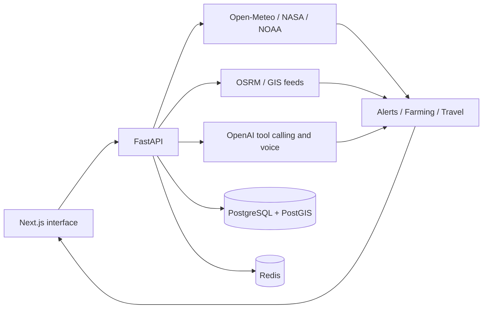

# WeatherGPT architecture

The monorepo contains `frontend/` (Next.js 15 and React 19), `backend/` (async FastAPI), and `docs/`. The browser calls a same-origin `/api` proxy. Access tokens live in memory; refresh sessions use HttpOnly cookies and hashed, rotating server-side tokens. PostgreSQL/PostGIS is required in production; SQLite is an explicit local development mode. Redis supplies shared caching, rate limiting, and live alert pub/sub.

## Entity relationships

`users` owns many `locations`, `routes`, `agriculture_reports`, `chat_history`, `refresh_sessions`, `push_subscriptions`, and `notification_deliveries`, plus one `notification_settings` row. All owner references cascade on deletion. `weather_cache` and `historical_weather` store shared public provider responses; `alerts` stores provider-issued alerts. Saved locations, alerts, weather cache, and agriculture reports have generated WGS84 geography points with GIST indexes. Routes preserve provider GeoJSON; a second migration adds spatial route geometry. Every record has creation and update timestamps. IDs are generated server-side UUIDs.

SQL migrations are versioned and run transactionally under a PostgreSQL advisory lock. The API never interpolates user input into SQL. It applies owner filters to private records. Supabase browser clients must not directly access these backend-owned tables.

## Trust and data boundaries

GPS is location, never an observation of temperature. Model comparisons require time-aligned uploaded measurements. Deterministic risk screening is explicitly distinguished from official warnings. Missing feeds return unavailable status, never invented alerts, clear roads, or safe zones. Weather and climate estimates carry sources and observation/model times. OpenAI output includes a self-assessed confidence value, not a calibrated probability.
